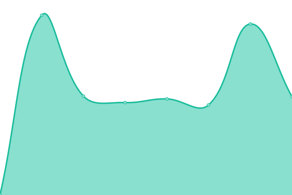
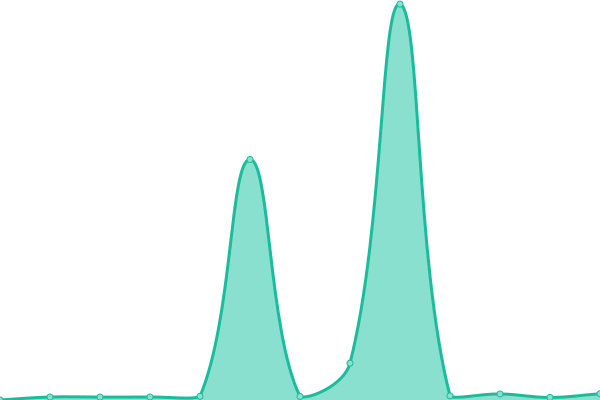

# [📈 Live Status](https://JSAnyone.github.io/upptime): <!--live status--> **🟧 Partial outage**

<!--start: status pages-->
<!-- This summary is generated by Upptime (https://github.com/upptime/upptime) -->
<!-- Do not edit this manually, your changes will be overwritten -->
<!-- prettier-ignore -->
| URL | Status | History | Response Time | Uptime |
| --- | ------ | ------- | ------------- | ------ |
|  Startpage | 🟩 Up | [startpage.yml](https://github.com/jscmidt/upptime/commits/HEAD/history/startpage.yml) | 

 1344ms
     
 | 

<a href="https://JSAnyone.github.io/upptime/history/startpage">91.73%</a>
    

|  Piwigo | 🟩 Up | [piwigo.yml](https://github.com/jscmidt/upptime/commits/HEAD/history/piwigo.yml) | 

 793ms
     
 | 

<a href="https://JSAnyone.github.io/upptime/history/piwigo">91.95%</a>
    

|  Tandoor | 🟩 Up | [tandoor.yml](https://github.com/jscmidt/upptime/commits/HEAD/history/tandoor.yml) | 

 600ms
     
 | 

<a href="https://JSAnyone.github.io/upptime/history/tandoor">92.24%</a>
    

|  Nextcloud | 🟩 Up | [nextcloud.yml](https://github.com/jscmidt/upptime/commits/HEAD/history/nextcloud.yml) | 

 1058ms
     
 | 

<a href="https://JSAnyone.github.io/upptime/history/nextcloud">70.34%</a>
    

|  Grafana | 🟩 Up | [grafana.yml](https://github.com/jscmidt/upptime/commits/HEAD/history/grafana.yml) | 

 632ms
     
 | 

<a href="https://JSAnyone.github.io/upptime/history/grafana">92.24%</a>
    

|  Vertretungspläne | 🟥 Down | [vertretungsplaene.yml](https://github.com/jscmidt/upptime/commits/HEAD/history/vertretungsplaene.yml) | 

 125ms
     
 | 

<a href="https://JSAnyone.github.io/upptime/history/vertretungsplaene">0.00%</a>
    

|  API | 🟩 Up | [api.yml](https://github.com/jscmidt/upptime/commits/HEAD/history/api.yml) | 

 132ms
     
 | 

<a href="https://JSAnyone.github.io/upptime/history/api">92.23%</a>
    

|  Linus-Wordpress | 🟩 Up | [linus-wordpress.yml](https://github.com/jscmidt/upptime/commits/HEAD/history/linus-wordpress.yml) | 

 826ms
     
 | 

<a href="https://JSAnyone.github.io/upptime/history/linus-wordpress">92.23%</a>
    

|  Lychee | 🟥 Down | [lychee.yml](https://github.com/jscmidt/upptime/commits/HEAD/history/lychee.yml) | 

 1324ms
     
 | 

<a href="https://JSAnyone.github.io/upptime/history/lychee">0.00%</a>
    

|  [Google](https://google.com) | 🟩 Up | [google.yml](https://github.com/jscmidt/upptime/commits/HEAD/history/google.yml) | 

 338ms
     
 | 

<a href="https://JSAnyone.github.io/upptime/history/google">100.00%</a>
    

<!--end: status pages-->

[**Visit the status website →**](https://JSAnyone.github.io/upptime)

[**Incident reports →**](https://github.com/JSAnyone/upptime/issues)

## Repository Status:

## 📄 License

- Powered by: [Upptime](https://github.com/upptime/upptime)
- Code: [MIT](./LICENSE) © [JSAnyone](https://JSAnyone.github.io/upptime)
- Data in the `./history` directory: [Open Database License](https://opendatacommons.org/licenses/odbl/1-0/)
